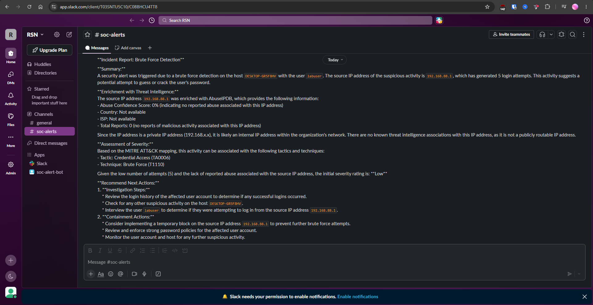

# 🛡️ SOC Automation Project — AI-Powered SOC Workflow

> A hands-on homelab project that builds a fully automated SOC pipeline: Splunk detects brute-force attacks → n8n orchestrates the response → AbuseIPDB enriches the threat intel → Groq (Llama 3.3) analyzes and triages the alert → Slack delivers the incident report.
---

## 📌 Table of Contents

- [Overview](#-overview)
- [Architecture](#-architecture)
- [Tools & Technologies](#-tools--technologies)
- [Prerequisites](#-prerequisites)
- [Lab Environment — VM Setup](#-lab-environment--vm-setup)
- [Part 1 — Splunk SIEM Setup (Host Machine)](#-part-1--splunk-siem-setup-host-machine)
- [Part 2 — Windows Telemetry (Splunk Forwarder)](#-part-2--windows-telemetry-splunk-forwarder)
- [Part 3 — n8n SOAR Setup (Docker)](#-part-3--n8n-soar-setup-docker)
- [Part 4 — Splunk Alert Creation](#-part-4--splunk-alert-creation)
- [Part 5 — Connect Splunk → n8n via Webhook](#-part-5--connect-splunk--n8n-via-webhook)
- [Part 6 — AbuseIPDB Threat Intel Enrichment](#-part-6--abuseipdb-threat-intel-enrichment)
- [Part 7 — Groq AI Analysis](#-part-7--groq-ai-analysis)
- [Part 8 — Slack Notification Integration](#-part-8--slack-notification-integration)
- [End-to-End Test](#-end-to-end-test)
- [Repository Structure](#-repository-structure)
- [Skills Demonstrated](#-skills-demonstrated)
- [Screenshots](#-screenshots)
- [References](#-references)


---

## 🔍 Overview

This project simulates a real-world Security Operations Center (SOC) workflow by chaining together a SIEM, a SOAR engine, an AI model, a threat intelligence API, and a messaging platform — running across your host machine and two virtual machines.

**What the pipeline does:**

1. A Windows 10 VM generates failed login events (Event ID 4625).
2. The Splunk Universal Forwarder ships those events to Splunk running on the host.
3. Splunk fires a scheduled alert and sends a webhook to n8n.
4. n8n calls AbuseIPDB to enrich the source IP reputation.
5. The enriched data is passed to Groq (Llama 3.3-70b), which acts as a Tier 1 SOC Analyst and generates a structured incident report.
6. The report is posted to a Slack `#soc-alerts` channel.



---

## 🏗️ Architecture

```
┌─────────────────────────────────────────────────────────────────┐
│                      HOST MACHINE                               │
│                                                                 │
│   ┌───────────────────────────────────────────────────────┐    │
│   │            Splunk Enterprise (SIEM)                   │    │
│   │            http://localhost:8000  |  Port 9997        │    │
│   └───────────────────────┬───────────────────────────────┘    │
│                           │ Webhook (HTTP POST)                 │
└───────────────────────────┼─────────────────────────────────────┘
                            │
┌───────────────────────────┼─────────────────────────────────────┐
│   HOME LAB VMs            │                                     │
│                           ▼                                     │
│   ┌──────────────┐   ┌──────────────────────────────────────┐  │
│   │  Windows 10  │   │  n8n (Ubuntu Server / Docker)        │  │
│   │  (Endpoint)  │   │  SOAR — http://<n8n-ip>:5678         │  │
│   │              │   │                                      │  │
│   │  Forwarder ──┼──►│  Webhook → AbuseIPDB → Groq → Slack │  │
│   └──────────────┘   └──────────────┬───────────────────────┘  │
└─────────────────────────────────────┼──────────────────────────┘
                                      │ HTTP Requests
              ┌───────────────────────┼──────────────────────┐
              ▼                       ▼                      ▼
   ┌──────────────────┐   ┌─────────────────┐   ┌──────────────────┐
   │  AbuseIPDB API   │   │  Groq API       │   │  Slack API       │
   │  (IP Reputation) │   │  Llama 3.3-70b  │   │  (#soc-alerts)   │
   │  Step 1          │──►│  AI Triage      │──►│  Step 3          │
   └──────────────────┘   │  Step 2         │   └──────────────────┘
                          └─────────────────┘
```

---

## 🧰 Tools & Technologies

| Category | Tool | Where It Runs |
|---|---|---|
| SIEM | Splunk Enterprise (free trial) | Host machine |
| Log Forwarder | Splunk Universal Forwarder | Windows 10 VM |
| SOAR / Automation | n8n (self-hosted via Docker) | Ubuntu VM |
| AI / LLM | Groq — Llama 3.3-70b-versatile (free tier) | Cloud API |
| Threat Intel | AbuseIPDB | Cloud API |
| Notification | Slack | Cloud |
| Hypervisor | VMware Workstation Pro | Host machine |

---

## ✅ Prerequisites

Download the following before starting:

**Hypervisor**:
- [VMware Workstation Pro](https://www.vmware.com/products/workstation-pro.html)

**ISO Images** (for VMs only):
- [Windows 10 ISO](https://www.microsoft.com/en-us/software-download/windows10) — use the "Create Windows 10 installation media" tool
- [Ubuntu Server 26.04 ISO](https://ubuntu.com/download/server) — for the n8n VM only

**Splunk Packages** — download the version that matches **your host OS**:
- [Splunk Enterprise](https://www.splunk.com/en_us/download/splunk-enterprise.html)
  - Windows host → `.msi` installer
- [Splunk Universal Forwarder](https://www.splunk.com/en_us/download/universal-forwarder.html) — Windows `.msi` (64-bit) for the Windows VM

**API Accounts** (all free tier):
- [Groq](https://console.groq.com/) — free API key, no billing required. 14,400 requests/day on the free tier
- [AbuseIPDB](https://www.abuseipdb.com/) — free API key
- [Slack](https://slack.com/) — free workspace

---

## 🖥️ Lab Environment — VM Setup

This build uses **2 VMs**. Splunk runs on the host, so no dedicated Splunk VM is needed.

| VM Name | Role | OS | vCPUs | RAM | Disk |
|---|---|---|---|---|---|
| `Windows 10` | Victim / Endpoint | Windows 10 Pro | 2 | 2 GB | 60 GB |
| `n8n` | SOAR / Automation | Ubuntu Server 24.04 | 2 | 2 GB | 40 GB |

> **Network:** Set both VMs to **NAT** mode. This gives them internet access and the ability to reach your host machine.

### 🔑 Finding Your Host IP (Critical for NAT Networking)

Your VMs need to send data to Splunk on the host. They do this via your **host machine's LAN IP**, not `localhost`. Find it before you start:

| Host OS | Command | Look for |
|---|---|---|
| Windows | `ipconfig` | IPv4 Address under your active adapter |


Note this IP: you'll use it as the **Receiving Indexer address** when setting up the Universal Forwarder on the Windows VM.

### Windows 10 VM Setup

- During OOBE: choose **Offline account → Limited experience**
- Create a local user (e.g. `labuser`) with a password
- Enable **Remote Desktop**: Start → Remote desktop settings → Toggle **On**
- Run `ipconfig` in cmd and note the VM's IP address
- Take a VM snapshot: `Base Install`

### Ubuntu Server VM Setup (`n8n`)

- Keep all installer defaults; select **Use an entire disk**
- ✅ **Check "Install OpenSSH server"** 
- After first boot, SSH in from your host and update:

```bash
sudo apt-get update && sudo apt-get upgrade -y
```

- Run `ip a` and note the VM's IP address
- Take a snapshot: `Base Install`

---

## 📊 Part 1 — Splunk SIEM Setup (Host Machine)

### 1. Install Splunk Enterprise on Your Host

Run the installer for your OS and follow the wizard. Splunk will prompt you to set an admin username and password during install.

**Windows (.msi)**
```
Double-click the .msi → follow the setup wizard
Splunk installs to: C:\Program Files\Splunk\
It starts automatically as a Windows service.
Access: http://localhost:8000
```

### 2. Open Firewall Port 9997 (Windows Hosts Only)

Windows Defender blocks inbound connections by default. Add a rule so the Universal Forwarder on the VM can reach Splunk:

```
Windows Defender Firewall with Advanced Security →
Inbound Rules → New Rule → Port → TCP → Specific port: 9997 →
Allow the connection → Apply to all profiles →
Name: "Splunk Receiver"
```

### 3. Configure Data Receiving

In the Splunk web UI at `http://localhost:8000`:
- Go to **Settings → Forwarding & Receiving**
- Under "Receive data" → **Configure receiving → New Receiving Port: `9997`** → Save

### 4. Create an Index

- Go to **Settings → Indexes → New Index**
- Index Name: `soc-automation` → Save

### 5. Install the Windows Add-on

- Go to **Apps → Find More Apps**
- Search: `Splunk Add-on for Microsoft Windows` → Install
- You'll need your splunk.com login (not your Splunk server credentials)

---

## 📤 Part 2 — Windows Telemetry (Splunk Forwarder)

### 1. Install the Universal Forwarder on the Windows 10 VM

Transfer the `.msi` to the Windows 10 VM and run the installer:

- ✅ Accept the license
- Select **Splunk Enterprise (on-premise)**
- Set a local forwarder username/password
- **Deployment Server**: leave blank
- **Receiving Indexer:**
  - Host: `<YOUR HOST MACHINE'S LAN IP>` ← **not** `localhost`, **not** the VM's own IP
  - Port: `9997`

### 2. Configure `inputs.conf`

On the Windows 10 VM, navigate to:
```
C:\Program Files\SplunkUniversalForwarder\etc\system\local\
```

Create a new file named `inputs.conf` (also available as [configs/inputs.conf](configs/inputs.conf) in this repo):

```ini
[WinEventLog://Application]
index = soc-automation
disabled = false

[WinEventLog://Security]
index = soc-automation
disabled = false

[WinEventLog://System]
index = soc-automation
disabled = false

[WinEventLog://Microsoft-Windows-Sysmon/Operational]
index = soc-automation
disabled = false
renderXml = true
source = XmlWinEventLog:Microsoft-Windows-Sysmon/Operational

[WinEventLog://Microsoft-Windows Defender/Operational]
index = soc-automation
disabled = false
source = XmlWinEventLog:Microsoft-Windows Defender/Operational
blacklist = 1151,1150,2000,1002,1001,1000

[WinEventLog://Microsoft-Windows-Powershell/Operational]
index = soc-automation
disabled = false
source = XmlWinEventLog:Microsoft-Windows-Powershell/Operational
blacklist = 4100,4105,4106,40961,40962,53504
```

### 3. Fix Forwarder Service Permissions

- Open `services.msc` as Administrator on the Windows 10 VM
- Find **SplunkForwarder** → Right-click → **Properties → Log On tab**
- Select **Local System account** → Apply → **Restart** the service

### 4. Verify Data in Splunk

In the Splunk Search bar at `http://localhost:8000`:

```spl
index="soc-automation"
```

Set time range to **Last 24 hours**. You should see Windows events flowing in from the VM.

> **No events showing up?** Check two things: (1) confirm the host LAN IP is correct in the forwarder installer, and (2) confirm port 9997 is open in your host firewall (see Part 1, Step 2).

---

## 🤖 Part 3 — n8n SOAR Setup (Docker)

SSH into your `n8n` VM:

### 1. Install Docker

```bash
sudo apt install docker.io -y
sudo apt install docker-compose -y
```

> **Troubleshoot**: If you get "fail to fetch" errors, edit `/etc/apt/sources.list.d/ubuntu.sources` and remove the `ir.` prefix from any mirror URLs, then re-run `sudo apt update`.

### 2. Create the Docker Compose File

```bash
mkdir ~/n8n-compose && cd ~/n8n-compose
nano docker compose.yaml
```

Paste the following (replace `<n8n-vm-ip>` with your actual IP):

```yaml
services:
  n8n:
    image: n8nio/n8n:latest
    restart: always
    ports:
      - "5678:5678"
    environment:
      - N8N_HOST=<n8n-vm-ip>
      - N8N_PORT=5678
      - N8N_PROTOCOL=http
      - N8N_SECURE_COOKIE=false
      - GENERIC_TIMEZONE=America/Toronto
    volumes:
      - ./n8n_data:/home/node/.n8n
```

### 3. Start n8n

```bash
sudo docker compose pull
sudo docker compose up -d
```

> **Troubleshoot** — "Connection Refused" due to permissions:
> ```bash
> sudo chown -R 1000 n8n_data
> sudo docker-compose down && sudo docker-compose up -d
> ```

Access n8n at `http://<n8n-vm-ip>:5678`. Create your owner account.

> Take a snapshot: `n8n-installed`

---

## 🚨 Part 4 — Splunk Alert Creation

### 1. Generate Brute Force Telemetry

From your host machine, open **Remote Desktop (RDP)** to the Windows 10 VM IP and enter an **incorrect password 5 times**. This creates Event ID 4625 (failed login) entries.

### 2. Build the Detection Query

In Splunk's Search & Reporting app at `http://localhost:8000`:

```spl
index="soc-automation" EventCode=4625
| stats count by ComputerName, user, src_ip
```

Verify you see 5 failed login events before creating the alert.

### 3. Save as a Scheduled Alert

With the query running → **Save As → Alert**:

| Field | Value |
|---|---|
| Title | `brute-force-detection` |
| Description | Detects multiple failed RDP/login attempts |
| Alert Type | Scheduled |
| Time Range | Last 5 Minutes |
| Cron Schedule | `*/5 * * * *` (every 5 minutes, for testing) |
| Trigger When | `search count > 2` |
| Trigger Action | Add to Triggered Alerts + Webhook |

Leave the dialog open — you'll paste the n8n webhook URL in the next step.

---

## 🔗 Part 5 — Connect Splunk → n8n via Webhook

### 1. Create Webhook Node in n8n

- Open n8n → **New Workflow → Add first step → Webhook**
- HTTP Method: **POST**
- Copy the **Test URL** (e.g. `http://<n8n-ip>:5678/webhook-test/...`)

### 2. Paste URL into Splunk Alert

- Back in the Splunk alert dialog, paste the n8n Test URL into the **Webhook URL** field → Save

### 3. Verify Connection

- In n8n, click **"Listen for test event"**
- Wait up to 5 minutes for the scheduled alert to fire
- You should see the webhook receive a payload with: `ComputerName`, `user`, `src_ip`, `count`

> Once data arrives, click **"Pin Data"** on the Webhook node — this lets you build the rest of the workflow without waiting for Splunk to fire every minute.

> Also **temporarily disable** the alert: in Splunk at `http://localhost:8000` → Settings → Searches, reports, and alerts → brute-force-detection → Edit → Disable

---

## 🌍 Part 6 — AbuseIPDB Threat Intel Enrichment

AbuseIPDB runs as the **first HTTP Request node** after the webhook — before Groq. Its output gets passed directly into the Groq prompt so the AI already has enriched threat intel when it writes the report.

### 1. Get Your API Key

Register at [abuseipdb.com](https://www.abuseipdb.com/) → **API → Create Key** → copy it.

### 2. Add the AbuseIPDB HTTP Request Node

In n8n, click **+** after the Webhook node → **HTTP Request** → configure:

| Setting | Value |
|---|---|
| Method | GET |
| URL | `https://api.abuseipdb.com/api/v2/check` |
| Authentication | Header Auth |
| Header Name | `Key` |
| Header Value | Your AbuseIPDB API key |
| Header Name 2 | `Accept` |
| Header Value 2 | `application/json` |

Under **Query Parameters**, click **Add Parameter**:

| Parameter | Value |
|---|---|
| `ipAddress` | `{{ $json.body.result.src_ip }}` (expression — pulls the IP from the Splunk webhook payload) |
| `maxAgeInDays` | `90` |

### 3. Verify the Response

Click **Test step**. You should get back a JSON response like:

```json
{
  "data": {
    "ipAddress": "80.94.95.223",
    "abuseConfidenceScore": 100,
    "countryCode": "RO",
    "isp": "Serverius",
    "totalReports": 1847
  }
}
```

> **No response / empty `src_ip`?** Your test Splunk alert may not have a real source IP yet. Temporarily hardcode a known IP in the `ipAddress` field (e.g. `80.94.95.223`) to confirm the AbuseIPDB connection works, then swap back to the expression.

Connect: **Webhook → AbuseIPDB**

---

## 🧠 Part 7 — Groq AI Analysis

### 1. Get Your Groq API Key

- Go to [console.groq.com](https://console.groq.com/) and sign up with your Google account
- Go to **API Keys → Create API Key** → copy it

> ✅ No billing, no credit card. The free tier gives 14,400 requests/day — more than enough for this lab.

### 2. Add the Groq HTTP Request Node

n8n has no native Groq node, but Groq's API is OpenAI-compatible, so a standard HTTP Request node works perfectly.

In n8n, click **+** after the AbuseIPDB node → **HTTP Request** → configure:

| Setting | Value |
|---|---|
| Method | POST |
| URL | `https://api.groq.com/openai/v1/chat/completions` |
| Authentication | Header Auth |
| Header Name | `Authorization` |
| Header Value | `Bearer YOUR_GROQ_API_KEY` |
| Header Name 2 | `Content-Type` |
| Header Value 2 | `application/json` |

### 3. Configure the Request Body

Under **Body → JSON**, paste the following — the expressions pull live data from the previous nodes:

```json
{
  "model": "llama-3.3-70b-versatile",
  "messages": [
    {
      "role": "system",
      "content": "Act as a Tier 1 SOC Analyst. When provided with a security alert or incident details (including IOCs, logs, or metadata), perform the following steps: 1. Summarize the alert - Provide a clear summary of what triggered the alert, which systems/user are affected, and the nature of the activity (e.g., suspicious login, malware detection, lateral movement). 2. Enrich with threat intelligence - Correlate any IOCs (IPs, domains, hashes) with known threat intel sources. Highlight if the indicators are associated with known malware or threat actors. 3. Assess severity - Based on MITRE ATT&CK mapping, identify tactics/techniques, and provide an initial severity rating (Low, Medium, High, Critical). 4. Recommend next actions - Suggest investigation steps and potential containment actions."
    },
    {
      "role": "user",
      "content": "Alert Name: {{ $('Webhook').item.json.body.search_name }}\n\nAlert Details: Host is {{ $('Webhook').item.json.body.result.ComputerName }}, User is {{ $('Webhook').item.json.body.result.user }}, Source IP is {{ $json.data.ipAddress }}, Count is {{ $('Webhook').item.json.body.result.count }}\n\n\nAbuseIPDB Enrichment for {{ $json.data.ipAddress }}:\n- Abuse Confidence Score: {{ $json.data.abuseConfidenceScore }}%\n- Country: {{ $json.data.countryCode }}\n- ISP: {{ $json.data.isp }}\n- Total Reports: {{ $json.data.totalReports }}\n\nGenerate a full incident report."
    }
  ],
  "temperature": 0.3,
  "max_tokens": 1024
}

```

> **Why `temperature: 0.3`?** Lower temperature makes the model more focused and consistent — ideal for structured security reports where you want predictable output, not creativity.

### 4. Extract the Response

Groq returns the report nested inside the response. The output field you need for Slack is:

```
{{ $json.choices[0].message.content }}
```

Note this expression — you'll use it in the next step.

Connect: **AbuseIPDB → Groq**

---

## 💬 Part 8 — Slack Notification Integration

### 1. Create a Slack App

- Go to [api.slack.com/apps](https://api.slack.com/apps) → **Create New App → From Scratch**
  - App Name: `soc-alert-bot`
  - Workspace: your workspace
- Go to **OAuth & Permissions → Bot Token Scopes** → Add:
  - `chat:write`
  - `channels:read`
- **Install to Workspace** → copy the **Bot User OAuth Token** (`xoxb-...`)

### 2. Set Up the Slack Channel

- Create a public channel: `#soc-alerts`
- Add the bot: type `/invite @soc-alert-bot` inside the channel

### 3. Add Slack Node in n8n

- Click **+** → search **Slack** → **Post a message**
- Create a credential using the `xoxb-` token
- Configuration:
  - Resource: **Message**
  - Operation: **Post**
  - Channel: `#soc-alerts`
  - Text: click the Expression icon → enter `{{ $json.choices[0].message.content }}`

Connect: **Groq → Slack**

---

## 🧪 End-to-End Test

### Run the Full Pipeline

1. **Re-enable the Splunk alert:** `http://localhost:8000` → Settings → Searches, reports, and alerts → brute-force-detection → Enable
2. **Activate the n8n workflow:** toggle to Active in the top-right
3. **RDP into the Windows 10 VM** with a wrong password 5+ times
4. Wait ~1 minute for Splunk to detect and fire

### Expected Result

- ✅ Splunk detects Event ID 4625 and fires `brute-force-detection`
- ✅ n8n webhook receives the alert payload
- ✅ AbuseIPDB returns IP reputation data for the source IP
- ✅ Groq (Llama 3.3-70b) generates a structured incident report using the alert + enrichment data
- ✅ Slack `#soc-alerts` receives the report

---

## 📁 Repository Structure

```
soc-automation-ai-groq/
│
├── README.md                          # This file
│
├── configs/
│   ├── inputs.conf                    # Splunk Universal Forwarder config (Windows VM)
│   └── docker-compose.yaml            # n8n Docker Compose file (Ubuntu VM)
│
├── n8n/
│   └── soc-automation-workflow.json   # Exported n8n workflow (importable via n8n UI)
│
├── screenshots/
│   ├── 01-splunk-events.png
│   ├── 02-splunk-alert-config.png
│   ├── 03-n8n-workflow.png
│   ├── 04-abuseipdb-node-config.png
│   ├── 05-groq-node-config.png
│   └── 06-slack-alert-output.png
```

---

## 🎓 Skills Demonstrated

**SIEM & Log Management**
- Installed Splunk Enterprise natively on a host OS (Windows/macOS/Linux)
- Configured cross-VM log forwarding: Universal Forwarder on a Windows endpoint ships Security event logs to Splunk on the host via NAT networking
- Wrote SPL queries to detect brute-force patterns (Event ID 4625)
- Built scheduled Splunk alerts with webhook trigger actions

**SOAR & Workflow Automation**
- Deployed n8n in a self-hosted Docker container on Ubuntu Server
- Designed a multi-node automation pipeline: Webhook → Threat Enrichment → AI Analysis → Notification
- Connected a SIEM to a SOAR platform via HTTP webhook (no-code integration)

**AI-Augmented Security Operations**
- Integrated Groq's OpenAI-compatible API (Llama 3.3-70b-versatile) into n8n using an HTTP Request node — no native node required
- Designed a multi-stage enrichment pipeline: threat intel pre-fetched via AbuseIPDB, then injected into the LLM prompt for context-aware triage
- Wrote structured system and user prompts aligned with real SOC Tier 1 triage workflows
- Applied prompt engineering techniques (role assignment, low temperature, structured output format)

**Threat Intelligence**
- Integrated AbuseIPDB API for real-time IP reputation scoring
- Mapped detections to MITRE ATT&CK T1110 (Brute Force)

**Networking & Infrastructure**
- Configured a 2-VM homelab with NAT networking
- Solved cross-environment connectivity (VM → host) using host LAN IP addressing
- Configured Windows Defender Firewall inbound rules for inter-machine communication
- Managed a Linux server via SSH and troubleshot Docker volume permissions

---

## 📸 Screenshots

| Image | Details |
|---|---|
| [Splunk Events](screenshots/01-splunk-events.png) | Search results showing 5x Event ID 4625 in the `soc-automation` index |
| [Splunk Alert Config](screenshots/02-splunk-alert-config.png) | The alert settings page showing cron schedule and webhook URL |
| [n8n Workflow](screenshots/03-n8n-workflow.png) | The full workflow canvas: Webhook → AbuseIPDB → Groq → Slack |
| [AbuseIPDB Node Config](screenshots/04-abuseipdb-node-config.png) | The AbuseIPDB HTTP Request node showing headers and query parameters |
| [Groq Node Config](screenshots/05-groq-node-config.png) | The Groq HTTP Request node showing the URL, auth header, and JSON body |
| [Slack Alert Output](screenshots/06-slack-alert-output.png) | The final AI-generated incident report in the Slack #soc-alerts channel |

---

## 🙏 References

- [Splunk Documentation](https://docs.splunk.com/)
- [n8n Documentation](https://docs.n8n.io/)
- [AbuseIPDB API Docs](https://docs.abuseipdb.com/)
- [MITRE ATT&CK — T1110: Brute Force](https://attack.mitre.org/techniques/T1110/)


